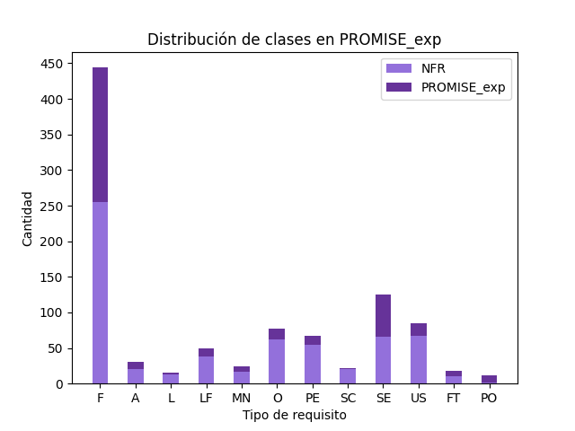
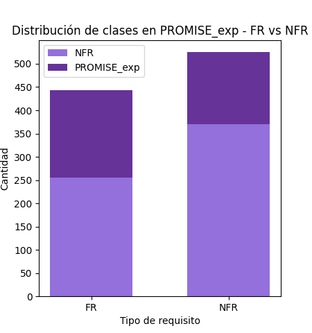

# Software Requirements Classification

**Publicacion:** [https://ieeexplore.ieee.org/document/9491688](https://ieeexplore.ieee.org/document/9491688)
**Publicacion:** [https://www.mdpi.com/1099-4300/22/9/1057](https://www.mdpi.com/1099-4300/22/9/1057) 

## Table of Contents
   1. [Introduccion](#introduccion)
   2. [Metodologia](#metodologia)
      1. [Normalizacion](#normalizacion)
      2. [Vectorizacion](#vectorizacion)
      3. [Feature extraction](#feature-extraction)
      4. [Feature selection](#feature-selection)
      5. [Clasificacion](#clasificacion)
      6. [Medicion](#medicion)
   3. [Dataset](#dataset)

## Introduccion
El conjunto de datos experimentado en este estudio fue PROMISE_exp, que incluye requisitos etiquetados. Todos los documentos de software de la base de datos fueron cambiados (limpiados) con un conjunto de pasos (normalización, extracciones, selección de caracteristicas). 

<!-- El BoW utilizó el algoritmo SVM o el algoritmo KNN para la clasificación. Este estudio utilizó datos de PROMISE_exp para hacer el trabajo, la información de los pasos utilizados para volver a realizar la clasificación y la medición BoW, al utilizar los algoritmos SVM y KNN, la clasificación de los requisitos puede servir como una forma y recursos para otro estudio. Se puede ver que el uso de BoW con SVM es mejor que el uso de algoritmos KNN con una medida F promedio de todos los casos de 0,74. En trabajos futuros tenemos la intención de mejorar la técnica con la fusión y cambiar algunos algoritmos como la regresión Logiest para mejorar la precisión de nuestro modelo. -->

## Metodologia
### Normalizacion
La normalización de los datos es un paso importante en la preparación de los datos para el análisis. La normalización de los datos es el proceso de escalar los datos para que tengan una media de 0 y una desviación estándar de 1.

### Vectorizacion
La vectorización es el proceso de convertir texto en números. La vectorización de texto es un paso importante en el procesamiento de lenguaje natural (NLP). La vectorización de texto es el proceso de convertir texto en números. La vectorización de texto es un paso importante en el procesamiento de lenguaje natural (NLP).

- **Bag of Words (BoW):** El modelo de bolsa de palabras es una técnica de procesamiento de lenguaje natural que se utiliza para representar texto como una colección de palabras. El modelo de bolsa de palabras es una técnica de procesamiento de lenguaje natural que se utiliza para representar texto como una colección de palabras.

- **Term Frequency-Inverse Document Frequency (TF-IDF):** La frecuencia de término-frecuencia inversa de documento (TF-IDF) es una técnica de procesamiento de lenguaje natural que se utiliza para representar texto como una colección de palabras. La frecuencia de término-frecuencia inversa de documento (TF-IDF) es una técnica de procesamiento de lenguaje natural que se utiliza para representar texto como una colección de palabras.

### Feature extraction
Proceso de seleccionar un subconjunto de características relevantes para su uso en la construcción de modelos. La extracción de características es un paso importante en el análisis de datos y el aprendizaje automático.

### Feature selection
Proceso de seleccionar un subconjunto de características relevantes para su uso en la construcción de modelos. La selección de características es un paso importante en el análisis de datos y el aprendizaje automático.

Sobre las representaciones de BoW y TF-IDF, se aplicó selección de características mediante Chi-cuadrado, y posteriormente se aplicó PCA para reducir la dimensionalidad de los datos.

Por otro lado, las incrustaciones de palabras generadas con Word2Vec se utilizaron para entrenar clasificadores basados en redes neuronales recurrentes como Long Short-Term Memory (LSTM) y Unidades Recurrentes Gated (GRU).

### Clasificacion
Proceso de predecir la clase de un objeto en función de sus características. La clasificación es un paso importante en el análisis de datos y el aprendizaje automático.

Se implementaron los siguientes algoritmos de clasificación de ML:
- **Support Vector Machine (SVM):** Máquina de vectores de soporte (SVM) es un algoritmo de aprendizaje supervisado que se utiliza para clasificar objetos en dos o más clases. Máquina de vectores de soporte (SVM) es un algoritmo de aprendizaje supervisado que se utiliza para clasificar objetos en dos o más clases.
- **K-Nearest Neighbors (KNN):** K-Nearest Neighbors (KNN) es un algoritmo de aprendizaje supervisado que se utiliza para clasificar objetos en dos o más clases. K-Nearest Neighbors (KNN) es un algoritmo de aprendizaje supervisado que se utiliza para clasificar objetos en dos o más clases.
- **Logistic Regression:** La regresión logística es un algoritmo de aprendizaje supervisado que se utiliza para clasificar objetos en dos o más clases. La regresión logística es un algoritmo de aprendizaje supervisado que se utiliza para clasificar objetos en dos o más clases.
- **Multinomial Naive Bayes:** El clasificador Naive Bayes multinomial es un algoritmo de aprendizaje supervisado que se utiliza para clasificar objetos en dos o más clases. El clasificador Naive Bayes multinomial es un algoritmo de aprendizaje supervisado que se utiliza para clasificar objetos en dos o más clases.

y tambien se implementaron los siguientes algoritmos de clasificación basados en redes neuronales:

- **Long Short-Term Memory (LSTM)** 
- **Unidades Recurrentes Gated (GRU)**

### Medicion
La medición es el proceso de evaluar el rendimiento de un modelo. La medición es un paso importante en el análisis de datos y el aprendizaje automático.

Se utilizaron las siguientes métricas para evaluar el rendimiento de los modelos:
- **Accuracy:** La precisión es una métrica que mide la proporción de predicciones correctas realizadas por un modelo.
- **Precision:** La precisión es una métrica que mide la proporción de predicciones positivas correctas realizadas por un modelo.
- **Recall:** La recuperación es una métrica que mide la proporción de instancias positivas que un modelo predice correctamente.
- **F1-score:** La puntuación F1 es una métrica que combina la precisión y la recuperación en una sola puntuación.

## Dataset
El repositorio de código abierto original **tera-PROMISE** consiste en 625 requisitos en lenguaje natural etiquetados, de los cuales 255 son funcionales y 370 no funcionales [\[4\]](#ref-4). El corpus se ha formado recopilando requisitos de quince proyectos distintos. Las siguientes clases de requisitos no funcionales están representadas: 
**disponibilidad, legales, apariencia, mantenibilidad, operabilidad, rendimiento, escalabilidad, seguridad, usabilidad, tolerancia a fallos y portabilidad.**

Motivados por los desafíos reportados relacionados con el tamaño del conjunto de datos de requisitos no funcionales de tera-PROMISE, Lima et al. crearon el conjunto de datos expandido **PROMISE_exp**, que contiene 444 requisitos funcionales y 525 no funcionales [\[1\]](#ref-1). Los autores utilizaron el motor de búsqueda de Google para recopilar documentos de Especificación de Requisitos de Software, luego realizaron un análisis manual, extracción y clasificación, seguido de la validación de los tipos de requisitos resultantes mediante consenso de expertos. Se ha tomado cuidado de garantizar que los nuevos requisitos sean compatibles con los datos originales: el sistema de codificación, la granularidad, el estilo del lenguaje y el formalismo se han preservado. Simultáneamente, se logró una mayor diversidad; **PROMISE_exp** contiene requisitos procedentes de 34 proyectos adicionales. 

<table>
	<tr><th align="center">Requirement Type</th><th align="center">Count</th></tr>
	<tr><td align="center">Functional Requirement (F)</td><td align="center">444</td></tr>
	<tr><td align="center">Availability (A)</td><td align="center">31</td></tr>
	<tr><td align="center">Legal (L)</td><td align="center">15</td></tr>
	<tr><td align="center">Look-and-feel (LF)</td><td align="center">49</td></tr>
	<tr><td align="center">Maintainability (MN)</td><td align="center">24</td></tr>
	<tr><td align="center">Operability (O)</td><td align="center">77</td></tr>
	<tr><td align="center">Performance (PE)</td><td align="center">67</td></tr>
	<tr><td align="center">Scalability (SC)</td><td align="center">22</td></tr>
	<tr><td align="center">Security (SE)</td><td align="center">125</td></tr>
	<tr><td align="center">Usability (US)</td><td align="center">85</td></tr>
	<tr><td align="center">Fault Tolerance (FT)</td><td align="center">18</td></tr>
	<tr><td align="center">Portability (PO)</td><td align="center">12</td></tr>
	<tr><td align="center"><em>Total</em></td><td align="center">969</td></tr>
</table>

